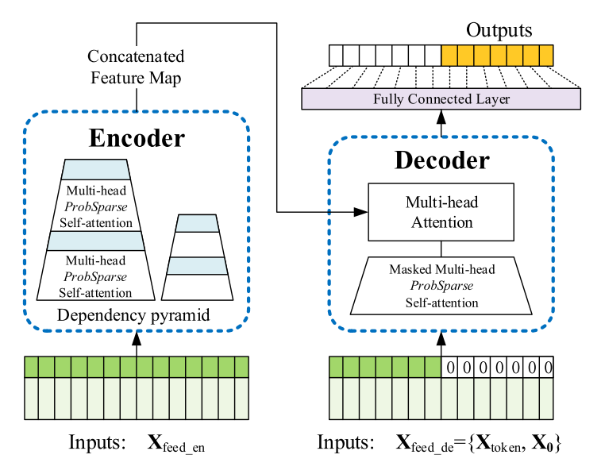

# Former Models for Long-Term Series Forecasting (LTSF)

English | [简体中文](README.md)

This is a distributed-training implementation of former models ([*Informer*](https://github.com/zhouhaoyi/Informer2020) and [*Autoformer*](https://github.com/thuml/Autoformer)), 
which aim at conducting Long-Term Series Forecasting (LTSF).
+ [Informer: Beyond Efficient Transformer for Long Sequence Time-Series Forecasting (AAAI 2021)](https://ojs.aaai.org/index.php/AAAI/article/view/17325)
+ [Autoformer: Decomposition Transformers with Auto-Correlation for Long-Term Series Forecasting (NeurIPS 2021)](https://arxiv.org/abs/2106.13008)



## Requirements

- hfai (to be released soon)
- torch >=1.8


## Training
The raw data is from [Github:Autoformer](https://github.com/thuml/Autoformer) , which is integrated into the dataset warehouse, `hfai.datasets`, including: `ETTh1`, `ETTh2`, `ETTm1`, `ETTm2`, `exchange_rate`, `electricity`, `national_illness`, `traffic`。 使用参考[hfai开发文档](#)。

1. train informer

   submit the task to Yinghuo HPC:
   ```shell
    hfai python train.py --ds ETTh1 --model informer -- -n 1 -p 30
   ```
   run locally:
   ```shell
    python train.py --ds ETTh1 --model informer
   ```

2. train Autoformer

   submit the task to Yinghuo HPC:
   ```shell
    hfai python train.py --ds ETTh1 --model autoformer -- -n 1 -p 30
   ```
   run locally:
   ```shell
    python train.py --ds ETTh1 --model autoformer
   ```

## Samples


## References
+ [Informer](https://github.com/zhouhaoyi/Informer2020)
+ [Autoformer](https://github.com/thuml/Autoformer)


## Citation

```bibtex
@inproceedings{haoyietal-informer-2021,
  author    = {Haoyi Zhou and
               Shanghang Zhang and
               Jieqi Peng and
               Shuai Zhang and
               Jianxin Li and
               Hui Xiong and
               Wancai Zhang},
  title     = {Informer: Beyond Efficient Transformer for Long Sequence Time-Series Forecasting},
  booktitle = {The Thirty-Fifth {AAAI} Conference on Artificial Intelligence, {AAAI} 2021, Virtual Conference},
  volume    = {35},
  number    = {12},
  pages     = {11106--11115},
  publisher = {{AAAI} Press},
  year      = {2021},
}
```

```bibtex
@inproceedings{wu2021autoformer,
  title={Autoformer: Decomposition Transformers with {Auto-Correlation} for Long-Term Series Forecasting},
  author={Haixu Wu and Jiehui Xu and Jianmin Wang and Mingsheng Long},
  booktitle={Advances in Neural Information Processing Systems},
  year={2021}
}
```